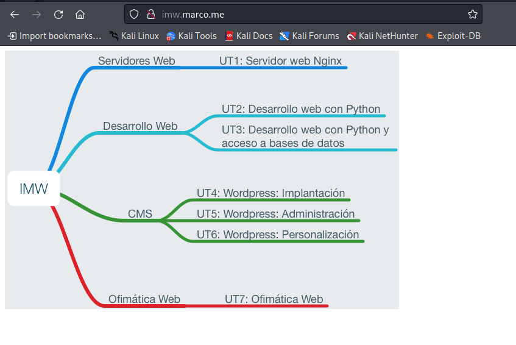
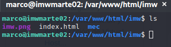
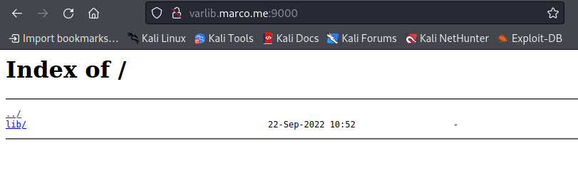
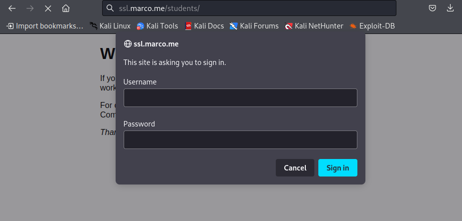
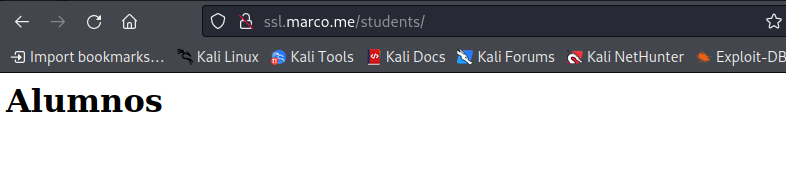
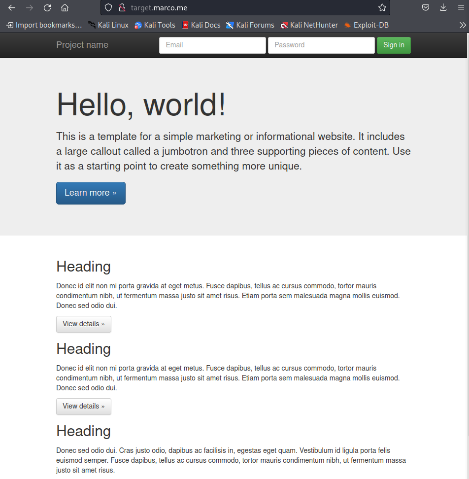
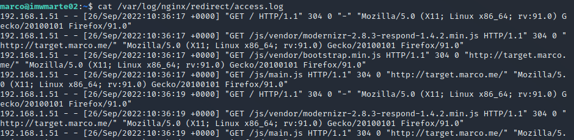
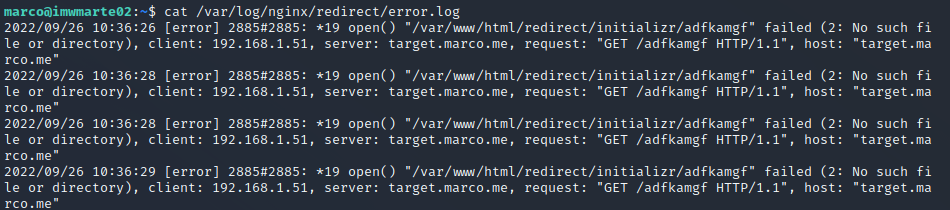

<center>

# UT1-A3: Trabajo con virtual hosts


</center>

***Nombre:*** Marco José Gopar Mühlbacher
<br>
***Curso:*** 2º de Ciclo Superior de Administración de Sistemas Informáticos en Red.

### ÍNDICE

+ [Introducción](#id1)
+ [Objetivos](#id2)
+ [Material empleado](#id3)
+ [Desarrollo](#id4)
+ [Conclusiones](#id5)


#### ***Introducción***. <a name="id1"></a>

La actividad cosiste en configurar o crear 4 virtual host en nuestro servidor de nginx y configurar cada uno de forma distinta

#### ***Objetivos***. <a name="id2"></a>

Los objetivos de la práctica son variados, en el **1º Sitio web** hay que crear un host virtual donde la página tendrá una imagen y luego haya otra carpeta que nos enviara a otra página donde contendrá unos enlaces y dicha ruta no puede utilizar `location`.
En el **2º Sitio web** tenemos que crear un host virtual por un puerto especificado que en este caso será el `9000` quedaría algo así: `varlib.marco.me:9000` dentro se encontrará un listado de ficheros y directorios de `/var/lib`.
Después en el **3º Sitio web** tenemos que crear un host virtual donde nos pida usuario y contraseña, para entrar usaremos el fichero `.htpasswd`.
Y finalmente en el **4º Sitio web** tenemos que crear un host virtual llamado `redirect.marco.me` y este nos va a redirigir cualquier petición de dominio a `target.marco.me` eso quiere decir que si ponemos `redirect.marco.me/hola/` nos debería redirigir a `target.marco.me`. Después nos tenemos que descargar un zip y ponerlo de fichero en nuestra configuración. Y por último cambiar a donde van dirigidos los log de acceso y de error estos irán dirigidos a `/var/log/nginx/redirect`.

#### ***Material empleado***. <a name="id3"></a>

Usamos una máquina virtual de Ubuntu 18.04 en adaptador puente con ip estática con esta ip 172.19.99.112 y una máquina Kali para configurar los DNS (se puede realizar con cualquier otra máquina, pero en mi caso, use esa porque era la que tenía), también en adaptador puente.

Los hosts están configurados de esta forma:
```
172.19.99.112          imw.marco.me
172.19.99.112          varlib.marco.me
172.19.99.112          ssl.marco.me
172.19.99.112          redirect.marco.me
172.19.99.112          target.marco.me
```

#### ***Desarrollo***. <a name="id4"></a>

Teniendo en cuenta que ya estamos conectados por `ssh` a la máquina virtual y tenemos instalado nginx realizaremos los siguientes:
- [Host1](#h1)
- [Host2](#h2)
- [Host3](#h3)
- [Host4](#h4)

<hr>

### *Host1* <a name="h1"></a>

Creamos el host virtual:
```
sudo nano /etc/nginx/sites-available/imw.marco.me
```

Configuración:
```
server {

        server_name imw.marco.me;
        root /var/www/html/imw;


}
```

Luego hacemos un enlace simbólico para nuestro sitio web desde `/etc/nginx/sites-enabled` para tener la página disponible.

```
cd /etc/nginx/sites-enabled
```

```
ln -s ../sites-available/imw.marco.me 
```


Luego creamos la carpeta y el archivo html:
```
mkdir -p /var/www/html/imw/
```
```
sudo nano /var/www/html/imw/index.html
```

Nos descargamos la imagen, y lo ponemos en el archivo html de esta forma:
```html
<!DOCTYPE html>
<html lang="en">
<head>
    <meta charset="UTF-8">
    <meta http-equiv="X-UA-Compatible" content="IE=edge">
    <meta name="viewport" content="width=device-width, initial-scale=1.0">
    <title>IMW</title>
</head>
<body>
    <!--Sirve para poner una imagen en html-->
</body>
</html>
```

Comprobamos y reiniciamos:

```
sudo nginx -t
```
```
sudo systemctl reload nginx.service
```

Resultado:



Después para crear una sub carpeta, deberíamos tener una estructura tal que así:

```
mdkir mec
```



Luego creamos dentro un archivo html con los enlaces:

```
cd mec
```
```
sudo nano index.html
```

El archivo debe ser parecido a esto:

```html
<!DOCTYPE html>
<html lang="en">
<head>
    <meta charset="UTF-8">
    <meta http-equiv="X-UA-Compatible" content="IE=edge">
    <meta name="viewport" content="width=device-width, initial-scale=1.0">
    <title>MEC</title>
</head>
<body>
    <a href="https://www.boe.es/diario_boe/txt.php?id=BOE-A-2010-3028">MEC</a>
    <br>
    <a href="https://www3.gobiernodecanarias.org/medusa/eforma/campus/course/view.php?id=35761&section=0#tabs-tree-start">Moodle IMW</a>

</body>
</html>

```

Comprobamos y reiniciamos:
<a name="reinciar"></a>
```
sudo nginx -t
```
```
sudo systemctl reload nginx.service
```

Resultado:


Como podemos ver no hemos usado en ningún momento el `location` ni hemos entrado el archivo de configuración de nuestro host solamente hace falta crear una carpeta con un archivo adentro y funcionara.

<hr>

### *Host2* <a name="h2"></a>

Vamos a repetir los mismos pasos que antes para crear nuestro host virtual, está sería la configuración de este en particular:

```
sudo nano /etc/nginx/sites-available/varlib.marco.me
```

```
server {
        listen 9000; # Escucha por el puerto 9000

        server_name varlib.marco.me;
        root /var/www/html/varlib/;
        autoindex on;

}

```

```
cd /etc/nginx/sites-enabled
```

```
ln -s ../sites-available/varlib.marco.me 
```


Luego creamos un enlace simbólico dentro de la carpeta `/var/www/html/varlib`:

```
mkdir -p /var/www/html/varlib
```
```
cd /var/www/html/varlib
```
```
ln -s /var/lib
```

**[REINICIAMOS](#reinciar)**

Resultado:



**Si tenemos cortafuegos, darle permisos para qué pueda actuar por el puerto 9000 si no funcionara**(En mi caso yo lo tenía desactivado).

<hr>

### *Host3* <a name="h3"></a>

```
sudo nano /etc/nginx/sites-available/ssl.marco.me
```

Configuración de este Host:
```
server {

        server_name ssl.marco.me;


        location /students {

                root /var/www/html;
                auth_basic "Restricted Access"; #Activar la restricción de acceso
                auth_basic_user_file /var/www/html/students/.htpasswd; # Archivo donde se encuentra el nombre y la contraseña para poder logearte

        }


}

```


```
cd /etc/nginx/sites-enabled
```

```
ln -s ../sites-available/ssl.marco.me 
```

Creamos el archivo `.htpasswd` dentro de `/var/www/html/students/`.

```
mkdir -p /var/www/html/students
```
```
cd /var/www/html/students
```

Creamos una contraseña cifrada:
```
perl -le `print crypt("2asir", `fewsalt`)`
```

La metemos en `.htpasswd`:

```
sudo nano .htpasswd
```

El archivo debe estar igual que aquí:


Creamos los archivos que sean necesarios

```
sudo nano index.hmtl
```

**[REINICIAMOS](#reinciar)**

Resultado:





<hr>

### *Host4* <a name="h4"></a>

En este caso yo resolví este problema creando dos hosts virtuales, uno llamado `redirect.marco.me` y otro `target.marco.me`.


```
sudo nano /etc/nginx/sites-available/redirect.marco.me
```

Sus respectivas configuraciones:
- `redirect.marco.me`
```
server {

        server_name redirect.marco.me;
        return http://target.marco.me; #Esto lo que hace es devolver algo , en este caso es nuestro 2ºhost creado
}

```

```
sudo nano /etc/nginx/sites-available/target.marco.me
```

- `target.marco.me`
```
server {

        server_name target.marco.me;
        root /var/www/html/redirect/initializr;

}
```


```
cd /etc/nginx/sites-enabled
```

```
ln -s ../sites-available/redirect.marco.me 
```

```
ln -s ../sites-available/target.marco.me 
```


Luego nos descargamos el archivo **initializr-verekia-4.0.zip**. Y lo colocamos en nuestro sitio web.

Pasamos el archivo a la máquina virtual

```
scp ~/Descargas/initializr-verekia-4.0.zip marco@172.19.99.112:~
```

Descomprimimos:

```
unzip initializr-verekia-4.0.zip
```

Creamos la carpeta:

```
sudo mkdir -p /var/www/html/redirect/
```

Movemos:

```
sudo mv initializr /var/wwww/html/redirect/
```


Ahora cambiamos donde van dirigidos los log de acesso y error, primero creamos las carpetas correspondientes y luego cambiamos el archivo de configuración.

```
sudo mkdir -p /var/log/nginx/redirect/
```


```
sudo nano /etc/nginx/sites-available/target.marco.me
```

Fichero de configuración:

```
server {

        server_name target.marco.me;
        root /var/www/html/redirect/initializr;

        access_log /var/log/nginx/redirect/access.log; #Carpeta a la que va dirigido el fichero de acesso
        error_log /var/log/nginx/redirect/error.log; #Carpeta a la que va dirigido el fichero de error

}

```

**[REINICIAMOS](#reinciar)**


Resultado:







[video](video/video.mkv)


#### ***Conclusiones***. <a name="id5"></a>

Las conclusiones de esta práctica han sido diversas como la practica, ya que en esta práctica hemos tocado todos los puntos anteriores y nuevos puntos que no hemos dado, como por ejemplo de redirigir a otra página y lo que escuche por un puerto especificado. No era del todo complejo, pero requería de algo de búsqueda. He tenido algunas dificultades en el camino, en mi caso el que más problema me ha dado ha sido el de redirigir a otra página, ya que había muchas formas de hacerlo, pero al final encontré la forma más sencilla y rápida de hacerlo.


