<center>

# UT1-A4: Desplegando con Docker


</center>

***Nombre:*** Marco José Gopar Mühlbacher
<br>
***Curso:*** 2º de Ciclo Superior de Administración de Sistemas Informáticos en Red.

### ÍNDICE

+ [Introducción](#id1)
+ [Objetivos](#id2)
+ [Material empleado](#id3)
+ [Desarrollo](#id4)
+ [Conclusiones](#id5)


#### ***Introducción***. <a name="id1"></a>

En esta práctica realizaremos una migración de nuestra maquina de nginx a un docker dentro de esta misma maquina.

#### ***Objetivos***. <a name="id2"></a>

Los objetivos de está practica es saber que ficheros hay que mover para poder migrar bien a docker y también saber controlar docker de forma decente.

#### ***Material empleado***. <a name="id3"></a>

Usamos una máquina virtual de Ubuntu 18.04 en adaptador puente con ip estática con esta ip 172.19.99.112 y una máquina Kali para configurar los DNS (se puede realizar con cualquier otra máquina, pero en mi caso, use esa porque era la que tenía), también en adaptador puente.

Los hosts están configurados de esta forma:
```
172.19.99.112          imw.marco.me
172.19.99.112          varlib.marco.me
172.19.99.112          ssl.marco.me
172.19.99.112          redirect.marco.me
172.19.99.112          target.marco.me
```

También dentro de la maquina virtual con IP estática instalamos docker.

#### ***Desarrollo***. <a name="id4"></a>

Primero de todo es conectarno a la maquina virtual y descargar docker:

```
ssh marco@172.19.99.112
```
Instalación docker:

```
sudo apt-get update
```

```
sudo apt install apt-transport-https ca-certificates curl software-properties-common
```

```
curl -fsSL https://download.docker.com/linux/ubuntu/gpg | sudo apt-key add -
```

```
sudo add-apt-repository "deb [arch=amd64] https://download.docker.com/linux/ubuntu focal stable"
```

```
apt-cache policy docker-ce
```

```
sudo apt-get install docker-ce docker-ce-cli containerd.io docker-compose-plugin docker
```

Ejecutar docker sin SUDO:

```
sudo usermod -aG docker ${USER}
```

```
su - ${USER}
```

```
groups
```


Una vez instalado y configurado vamos a crear un una carpeta donde contendra el fichero de configuración de nginx y las webs:

```
sudo mkdir docker
```

Dentro crearemos otra carpeta donde iran los webs:

```
cd docker
```

```
mkdir web
```

Copiamos las host-virtuales de la maquina a esa carpeta:

```
cp -r /var/www/html/* web/
```

Luego copiamos el fichero de configuración por defecto de nginx de la maquina de docker ya que ahí pondremos todos nuestros host-virtuales sin necesidad de crear cada uno por separado sino que lo centramos todo en un unico fichero.Para eso tendremos que levantar nginx y copiar el fichero que tiene dentro:

```
docker run -it --rm -d -p 8080:80 --name web nginx
```

```
docker cp web:/etc/nginx/conf.d/default.conf .
```

```
docker stop web
```

Debería quedar así la carpeta:

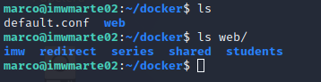


Ahora configuramos el fichero `default.conf` que deberia quedar tal que así:

```
sudo nano default.conf
```

Fichero:

```
server {
    listen       80;
    listen  [::]:80;
    server_name  localhost;

    #access_log  /var/log/nginx/host.access.log  main;

    location / {
        root   /usr/share/nginx/html;
        index  index.html index.htm;
    }


    #error_page  404              /404.html;

    # redirect server error pages to the static page /50x.html
    #
    error_page   500 502 503 504  /50x.html;
    location = /50x.html {
        root   /usr/share/nginx/html;
    }

    # proxy the PHP scripts to Apache listening on 127.0.0.1:80
    #
    #location ~ \.php$ {
    #    proxy_pass   http://127.0.0.1;
    #}

    # pass the PHP scripts to FastCGI server listening on 127.0.0.1:9000
    #
    #location ~ \.php$ {
    #    root           html;
    #    fastcgi_pass   127.0.0.1:9000;
    #    fastcgi_index  index.php;
    #    fastcgi_param  SCRIPT_FILENAME  /scripts$fastcgi_script_name;
    #    include        fastcgi_params;
    #}

    # deny access to .htaccess files, if Apache's document root
    # concurs with nginx's one
    #
    #location ~ /\.ht {
    #    deny  all;
    #}
}

##marco.me

server {

        server_name marco.me;
        root /usr/share/nginx/html;

        location /series {

                root /usr/share/nginx/html;

        }


        location /shared {
                autoindex on;
                root /usr/share/nginx/html;

        }


}

#varlib

server {
        listen 9000;

        server_name varlib.marco.me;
        root /var/lib;
        autoindex on;

}

#imw
server {

        server_name imw.marco.me;
        root /usr/share/nginx/html/imw;


}

#ssl
server {

        server_name ssl.marco.me;


        location /students {

                root /usr/share/nginx/html;
                auth_basic "Restricted Access";
                auth_basic_user_file /usr/share/nginx/html/students/.htpasswd;
        }

        location ~/.htpasswd {

                deny all;
                return 301;

        }


}

#redirect
server {

        server_name redirect.marco.me;
        return http://target.marco.me;
}
#target

server {

        server_name target.marco.me;
        root /usr/share/nginx/html/redirect/initializr;

        access_log /var/log/nginx/redirect/access.log;
        error_log /var/log/nginx/redirect/error.log;

}

```

Ahora creamos el fichero Dockerfile para poder luego crear una imagen con nuestras web ya creadas y solamente tendremos que levantarla:

```
cd ..
```

```
sudo nano Dockerfile
```

Fichero:

```
FROM nginx
COPY ./docker/default.conf /etc/nginx/conf.d/
COPY ./docker/web /usr/share/nginx/html
RUN mkdir -p /var/log/nginx/redirect/
```

- La primera instrucción significa que cogemos la imagen de Nginx
- La segunda instrucción es la copia de fichero de la maquina nuestra a la de docker.En docker el fichero de configuración se encuentra en `/etc/nginx/conf.d/`.
- La tercera instrucción es la copia de fichero de la maquina nuestra a la de docker.En docker la carpeta donde se encuntra las webs es en `/usr/share/nginx/html`
- La cuarta instrucción la usamos para crear la carpeta de logs de un ejercicio de clase.Ya que si no creamos nos dara un error.


Creamos la imagen:

```
docker build -t marcoj18/nginx-class:v1 .
```

Le puse ese nombre ya que lo voy subir docker hub y para ello se necesita poner el `nombre de usuario` , el `nombre de la imagen`y el `tag`.


**Antes de arrancar la imagen debemos para el servicio de nginx para que no haya conflictos**

```
sudo systemctl stop nginx
```
```
sudo systemctl disable nginx
```

Ahora para arrancar la imagen usamos el siguiente comando:

```
docker run -it -d -p 80:80 -p 9000:9000 --name myweb marcoj18/nginx-class:v1
```

Comprobaciones:

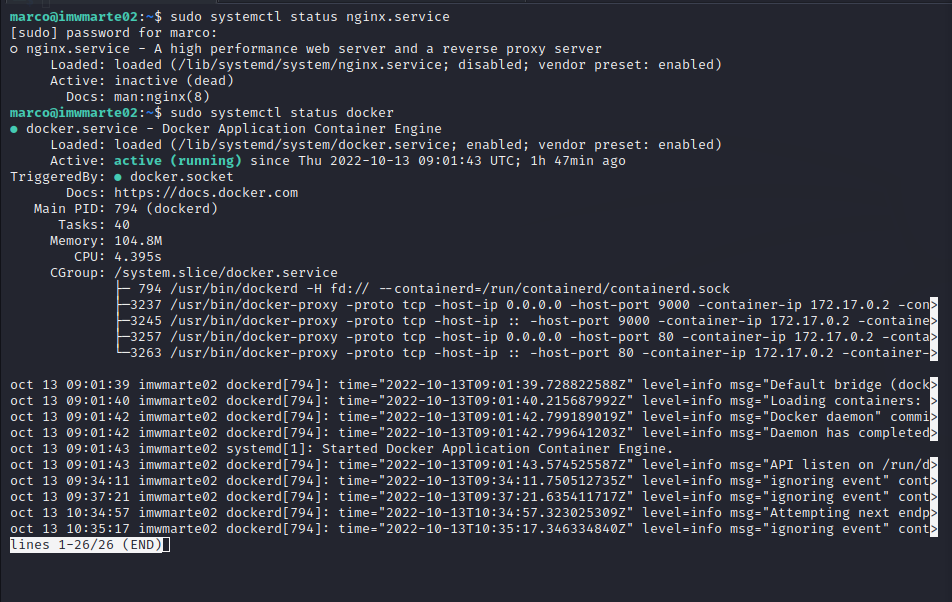

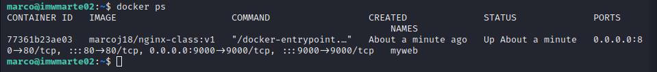

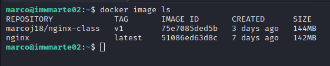

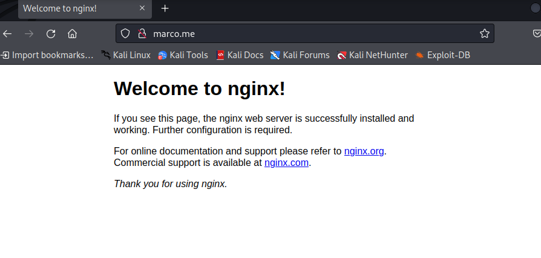


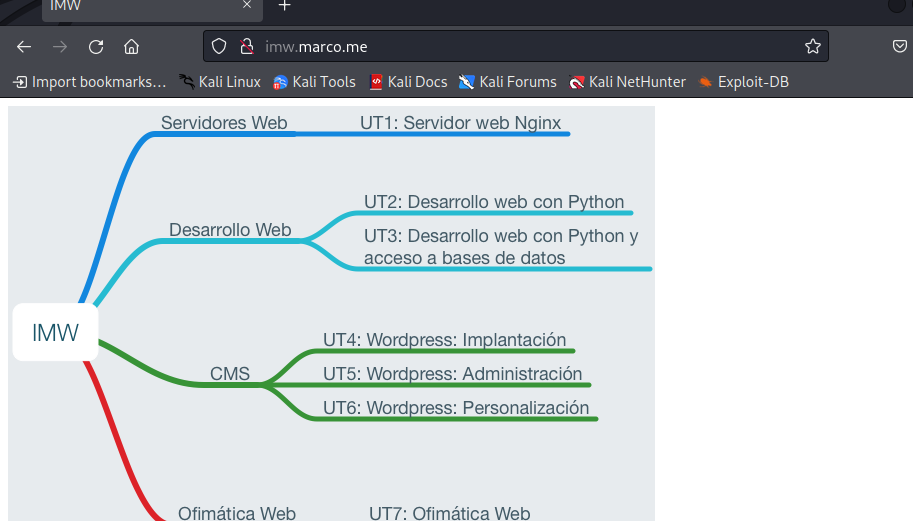

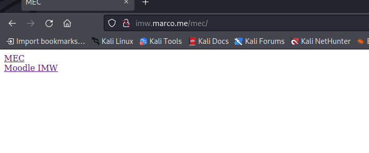

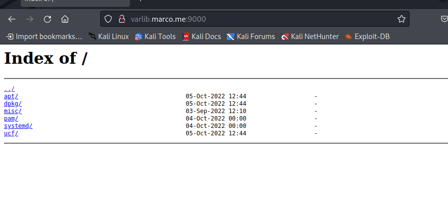

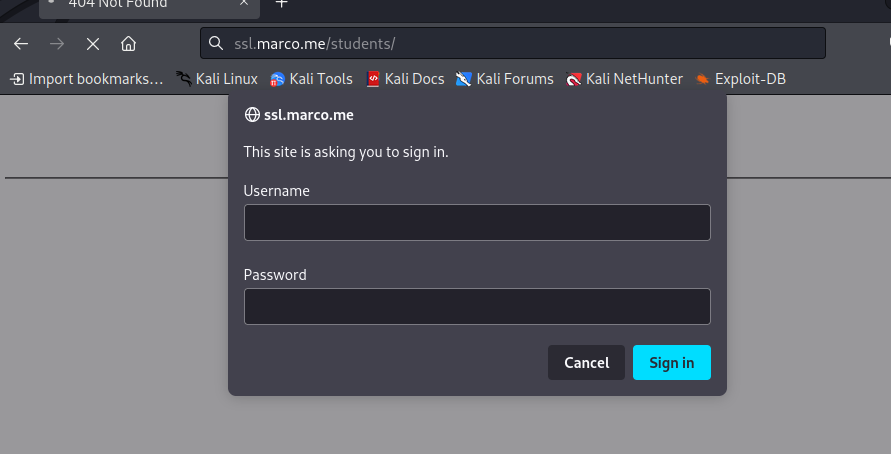

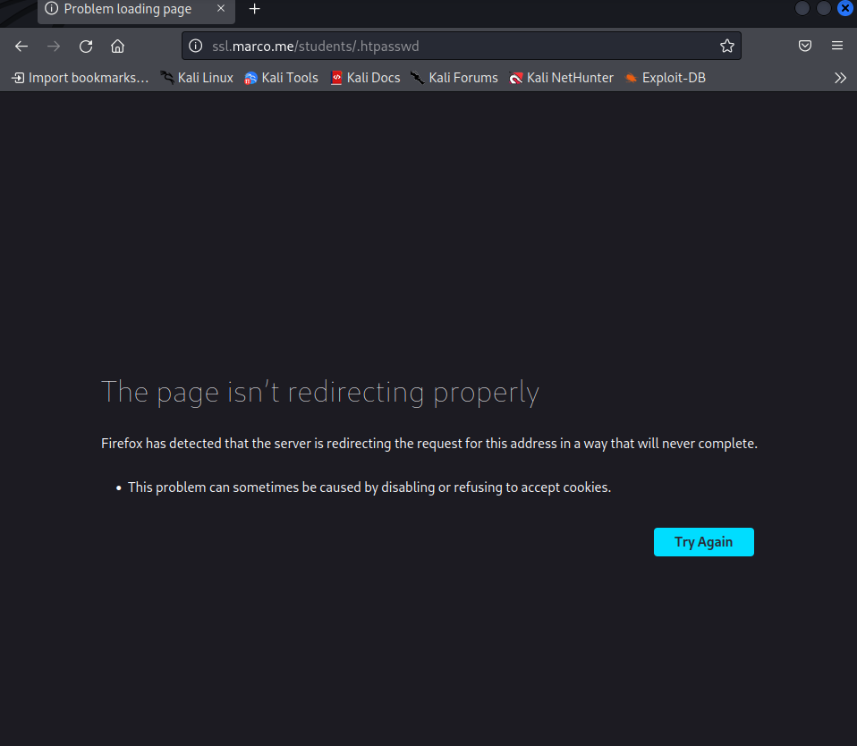

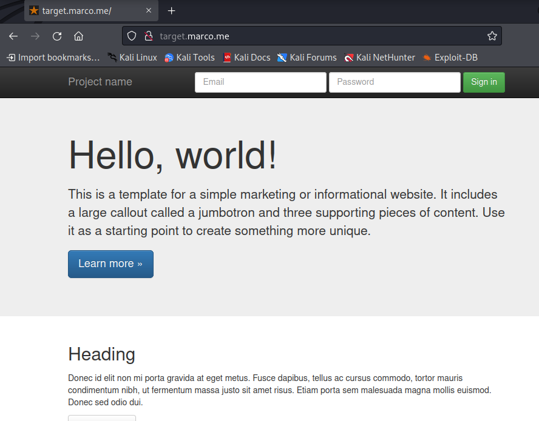


**Para logearte en docker usamos el siguiente comando:**

```
docker login
```

**Luego para subir la imagen a docker hub usamos el siguiente comando:**

```
docker push marcoj18/nginx-class:v1
```


#### ***Conclusiones***. <a name="id5"></a>

Como conclusión quiero comentar que fue un poco complicado realizar una migración ya que había muchas forma de realizarlo intente realizarlo de forma más optima y más sencilla posible ya que hay otras muchas mejores pero parecian más complejas de realizar. Por ejemplo usando docker-compose que es una forma de usar docker pero más facil ya que lo que hace es reducir los comando que usa docker por defecto y más.Pero como no soy un experto en docker use un fichero dockerfile para crealo aunque se pueda realizar con docker-compose ya que ahi se puede crear directamente tus host-virutales y todo de una forma más facil.Pero bueno al final la practica ha sido compleja al principo pero una vez lo comprendes como usar docker y donde se encuntrar los ficheros de nginx se vuelve más sencillo.
