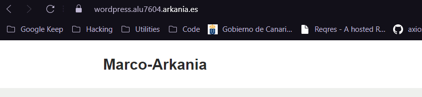
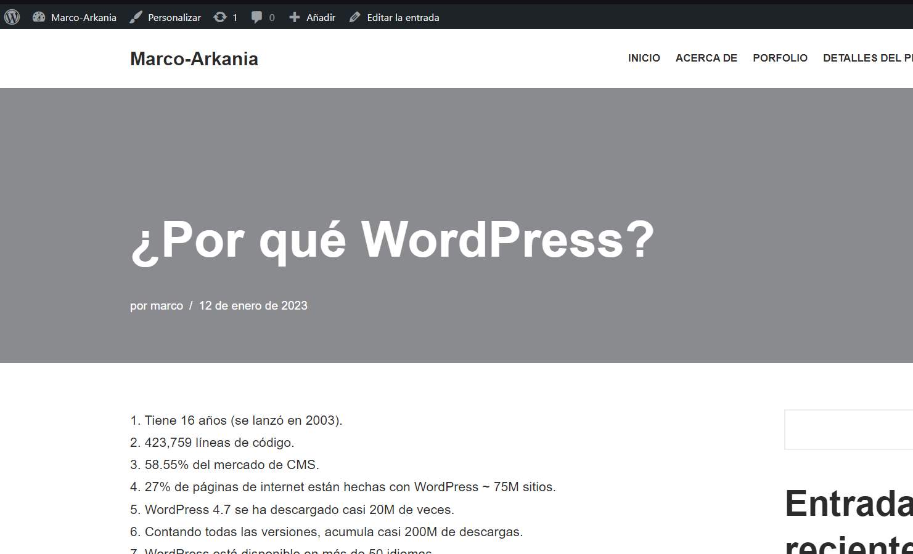

<center>

# UT4-A1: Implantación de Wordpress


</center>

***Nombre:*** Marco José Gopar Mülhbacher
<br>
***Curso:*** 2º de Ciclo Superior de Administración de Sistemas Informáticos en Red.

### ÍNDICE

+ [Introducción](#id1)
+ [Objetivos](#id2)
+ [Material empleado](#id3)
+ [Desarrollo](#id4)
+ [Conclusiones](#id5)


#### ***Introducción***. <a name="id1"></a>

Vamos a relizar los siguiente:

1. Realizar la instalación de Wordpress en el dominio wordpress.aluXXXX.arkania.es
2. Instalar y activar un tema gratuito.
3. Ajustar los permalinks a Día y Nombre.
4. Escribir un post con las estadísticas de uso de Wordpress vistas en clase y entrar a dicho post.

Añadir un certificado de seguridad con Let's Encrypt para que la comunicación con la web disponga de SSL.

#### ***Objetivos***. <a name="id2"></a>

Vamos a instalar wordpress en el VPS que tenemos que ya tiene descargado nginx y por ello debemos descargar mysql y php una vez tengamos las dos instalar wordpress

#### ***Material empleado***. <a name="id3"></a>

Usaremos la VPS que nos han entregado y los pdf para instalar mysql y php

#### ***Desarrollo***. <a name="id4"></a>

Lo primero de todo es entrar en la VPS luego actulizar todos los paquetes:

```bash
sudo apt-get update && sudo apt-get upgrade 
```

Luego instalarmos `mysql` de forma no segura:

```bash
sudo apt install -y mysql-server
```

Vemos que esta todo correcto:

```bash
sudo systemctl status mysql
```

Una vez instalado mysql es hora de instalar `php`:

```bash
sudo apt install -y php-fpm	#instala la más reciente
```

Comprobamos que esta todo correcto:

```bash
sudo systemctl status php8.1-fpm
```

Instalar tambien php-mysql ya que es una dependencia que necesita para que wordpress no tenga ningun problema:

```bash
sudo apt install -y php-mysql
```

Una vez tengamos todo preparado vamos a iniciar con la instalación de `WordPress`.

Primero accedemos a la base de datos:

```bash
sudo mysql 
```

Luego añadimos la base de datos, el usuario con su contraseña y le damos todos los privilegios a dicho usuario:

```mysql
create database wpdatabase;

create user wpuser@localhost indetified by 'password';

grant all privileges on wpdatabase.* to wpuser@localhost;

exit;
```

Luego en una carpeta temporal descargamos `WordPress`:

```bash
mkdir tmp
```
```bash
cd tmp
```
```bash
curl -O https://wordpress.org/latest.zip
```
```bash
unzip latest.zip
```
```bash
sudo cp -r wordpress /usr/share/
```

Damos privilegios:

```bash
sudo chown -R www-data:www-data /usr/share/wordpress/
```

Editamos los ficheros:

```bash
cd /usr/share/wordpress/
```

```bash
sudo cp wp-config-sample.php wp-config.php
```

```bash
sudo nano wp-config.php
```

Lo dejamos igual que esto pero con tus propios datos:

```bash
...
// ** MySQL settings - You can get this info from your web host ** //
/** The name of the database for WordPress */
define('DB_NAME', 'wpdatabase');
/** MySQL database username */
define('DB_USER', 'wpuser');
/** MySQL database password */
define('DB_PASSWORD', 'Testing_1234');
/** MySQL hostname */
define('DB_HOST', 'localhost');
/** Database Charset to use in creating database tables. */
define('DB_CHARSET', 'utf8mb4');
/** The Database Collate type. Don't change this if in doubt. */
define('DB_COLLATE', '');
...
```

Configuramos el nginx de la siguiente forma:

```bash
sudo nano /etc/nginx/sites-available/wordpress
```
Fichero `wordpress`:

```bash
server {
        server_name wordpress.alu7604.arkania.es;
        root /usr/share/wordpress;
        index index.php;
        location ~ \.php$ {
                include snippets/fastcgi-php.conf;
                fastcgi_pass unix:/run/php/php8.1-fpm.sock;
        }


        location / {
                try_files $uri $uri/ /index.php?$args; # Esto sirver para más adelante para que puede cargar las subpaginas
        }
}
```
```bash
sudo ln -s /etc/nginx/sites-available/wordpress /etc/nginx/sites-enabled/
```

Reiniciamos:

```bash
sudo systemctl reload nginx
```

Añadimos https con `cerbot`:

```bash
sudo cerbot --nginx
```
**Le damos a Enter y Expand**

Resultado:



Instalamos y activamos un tema gratuito:


Ajustar los permalinks a Día y Nombre:


Escribir un post con las estadísticas de uso de Wordpress vistas en clase y entrar a dicho post:




#### ***Conclusiones***. <a name="id5"></a>

En conclusion wordpress es una manera más sencilla de crear páginas web aparte de que la un 27% de las páginas estan hechas con este CMD. Aparte de que es una herramienta que facilita mucho el trabajo del desarrollador eso si la instalación es un poco tediosa pero más adelante lo realizaremos con docker y la instalación se hára en un click.

